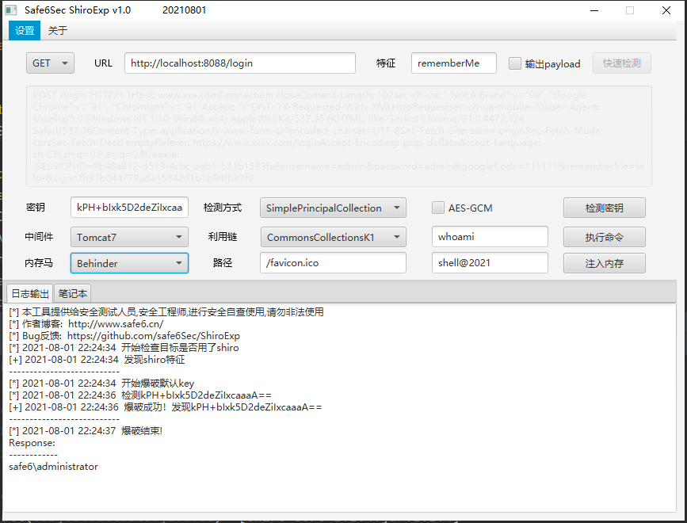
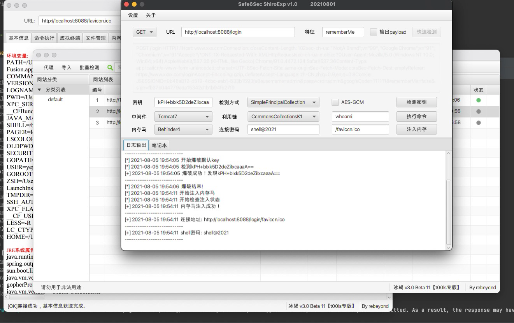

##  ShiroExp
**shiro综合利用工具**

### 0x01 说明

简单说一下，这个工具里面很多payload比如SimplePrincipalCollection进行检测、tomcat通用回显、cc链、内存马注入等等都是各位大佬花时间研究出来的成果。小弟只是学习漏洞原理之后习惯性的输出一个轮子。   
这个工具前前后后差不多搞了二十天左右才弄出来。本来打算上周末发出来，由于本人太菜鸡在内存马上卡了几天。      

### 0x02 使用
1. 先手工判断是否是shiro站点。
2. 发现有相关特征之后，可以尝试跑一下默认密钥(已经内置主流key,也可以使用自己的key文件。创建shirokey.txt文件放在程序目录)。某些站点rememberMe被改了，需要修改一下特征。也可以开启payload输出，方便复制进行手工检测。一般情况下用SimplePrincipalCollection检测就行，如遇到无回显之类的场景可以尝试用dnslog进行检测。
3. 拿到密钥之后就可以执行命令或者直接注入内存马。如遇到执行命令无回显，可以更换利用链再次尝试。注入内存马之前，需保证选择的利用链能正常执行命令。
4. 打点结束，开始下一步。

### 0x03 功能
该轮子主要有三大功能如下:
- 默认密钥爆破
  - 利用SimplePrincipalCollection进行检测
  - 利用dnslog进行检测，以解决无回显rememberMe。使用的是dnslog.cn
  - 支持高版本的AES-GCM算法
- 命令执行
  - 加入了shiro常用的利用链
  - 加入了两种tomcat通用回显
- 内存马注入
  - 冰蝎注入

### 0x04 Todo
1. 加入其他中间件通用回显
2. 加入更多的内存马注入
3. 分段传输解决，遇到waf的一些问题
4. 把filter马换成Listener马

### 0x05 参考
p牛的java安全漫谈  
[一种另类的 shiro 检测方式](https://mp.weixin.qq.com/s?__biz=MzIzOTE1ODczMg==&mid=2247485052&idx=1&sn=b007a722e233b45982b7a57c3788d47d&scene=21#wechat_redirect)  
[Shiro RememberMe 漏洞检测的探索之路](https://mp.weixin.qq.com/s/jV3B6IsPARRaxetZUht57w)  
[基于全局储存的新思路 | Tomcat的一种通用回显方法研究](https://mp.weixin.qq.com/s?__biz=MzIwNDA2NDk5OQ==&mid=2651374294&idx=3&sn=82d050ca7268bdb7bcf7ff7ff293d7b3)  
[Tomcat中一种半通用回显方法](https://xz.aliyun.com/t/7348#toc-0)  
[基于tomcat的内存 Webshell 无文件攻击技术](https://xz.aliyun.com/t/7388)  
[Shiro 550 漏洞学习 (二)：内存马注入及回显](http://wjlshare.com/archives/1545)  
[冰蝎改造之不改动客户端=>内存马](https://mp.weixin.qq.com/s/r4cU84fASjflHrp-pE-ybg)
### 0x06 免责声明

本工具仅能在取得足够合法授权的企业安全建设中使用，在使用本工具过程中，您应确保自己所有行为符合当地的法律法规。

如您在使用本工具的过程中存在任何非法行为，您将自行承担所有后果，本工具所有开发者和所有贡献者不承担任何法律及连带责任。

除非您已充分阅读、完全理解并接受本协议所有条款，否则，请您不要安装并使用本工具。

您的使用行为或者您以其他任何明示或者默示方式表示接受本协议的，即视为您已阅读并同意本协议的约束。

